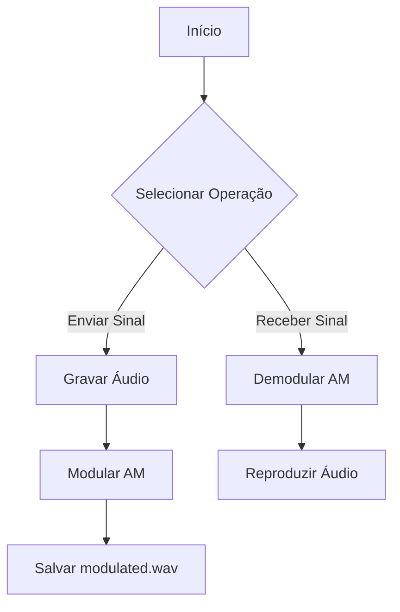

# Sistema de Modulação AM

## Visão Geral do Projeto
Sistema completo de modulação/demodulação AM com interface gráfica, desenvolvido em Python para fins educacionais em Telecomunicações.



# COMO EXECUTAR O PROJETO DE MODULAÇÃO AM

## PRÉ-REQUISITOS
- Python 3.6 ou superior instalado
- Sistema operacional Linux (recomendado) ou Windows com WSL
- Microfone e alto-falantes funcionais
- Conexão com internet para instalação de dependências

## INSTALAÇÃO PASSO-A-PASSO

# 1. Atualize os pacotes do sistema e instale dependências básicas
sudo apt update && sudo apt upgrade -y
sudo apt install -y python3-pip portaudio19-dev

# 2. Instale as bibliotecas Python necessárias
pip install numpy matplotlib sounddevice scipy

# 3. Clone o repositório do projeto
git clone https://github.com/ImArthz/Modulacao_AM.git

# 4. Acesse o diretório do projeto
cd Modulacao_AM

# 5. Execute o sistema
python3 index.py

## TROUBLESHOOTING (SOLUÇÃO DE PROBLEMAS)

# Caso encontre erros com o PortAudio:
sudo apt-get remove --purge python3-pyaudio
sudo apt-get install python3-pyaudio

# Caso tenha problemas com permissões:
sudo chmod -R 777 /dev/snd

# Para reinstalar todas as dependências Python:
pip uninstall numpy matplotlib sounddevice scipy
pip install --upgrade pip
pip install numpy matplotlib sounddevice scipy

## OPÇÕES DE EXECUÇÃO

# Executar em modo debug (mostra logs detalhados)
```
python3 index.py --debug
```

# Executar com taxa de amostragem personalizada (ex: 22050 Hz)
```
python3 index.py --sample-rate 22050
```

## AMBIENTE VIRTUAL (OPCIONAL RECOMENDADO)

# 1. Crie um ambiente virtual
```
python3 -m venv venv
```
# 2. Ative o ambiente
```
source venv/bin/activate   Linux/MacOS
 ou
.\venv\Scripts\activate    Windows
```

# 3. Instale as dependências dentro do ambiente virtual
```
pip install -r requirements.txt
```

## 🔧 Arquitetura do Sistema

<div style="display: grid; grid-template-columns: 1fr 1fr; gap: 20px; margin: 20px 0;">

<div style="background: #f8f9fa; padding: 15px; border-radius: 10px; box-shadow: 0 4px 6px rgba(0,0,0,0.1);">
<h3 style="text-align: center; margin-top: 0; color: #2c3e50;">Módulo de Transmissão</h3>
<ul>
  <li>Captura de áudio via sounddevice</li>
  <li>Normalização do sinal</li>
  <li>Modulação AM (10kHz)</li>
  <li>Salva em modulated.wav</li>
</ul>
</div>

<div style="background: #f8f9fa; padding: 15px; border-radius: 10px; box-shadow: 0 4px 6px rgba(0,0,0,0.1);">
<h3 style="text-align: center; margin-top: 0; color: #2c3e50;">Módulo de Recepção</h3>
<ul>
  <li>Detecção de envelope</li>
  <li>Filtro Butterworth (1.5kHz)</li>
  <li>Normalização</li>
  <li>Reprodução do áudio</li>
</ul>
</div>

</div>

## 📊 Visualização dos Sinais

<div style="display: grid; grid-template-columns: 1fr 1fr; gap: 25px; margin: 30px 0;">

<div style="background: #f8f9ff; padding: 15px; border-radius: 10px; box-shadow: 0 5px 15px rgba(0,0,0,0.1);">
<h4 style="text-align: center;">Transmissor</h4>

<ul style="font-size: 0.9em;">
  <li>Sinal de mensagem (300Hz-3.4kHz)</li>
  <li>Portadora (10 kHz)</li>
  <li>Sinal modulado AM</li>
</ul>
</div>

<div style="background: #f8f9ff; padding: 15px; border-radius: 10px; box-shadow: 0 5px 15px rgba(0,0,0,0.1);">
<h4 style="text-align: center;">Receptor</h4>

<ul style="font-size: 0.9em;">
  <li>Sinal modulado</li>
  <li>Envelope detectado</li>
  <li>Sinal demodulado</li>
</ul>
</div>

</div>

## 📚 Documentação Técnica

### Fórmula de Modulação AM
```
s(t) = [1 + m(t)]·c(t)
```
Onde:
- `m(t)`: Sinal de mensagem (áudio)
- `c(t)`: Portadora (10kHz)

### Bibliotecas Utilizadas
| Biblioteca   | Função                      |
|--------------|-----------------------------|
| NumPy        | Processamento de sinais     |
| SciPy        | Filtros digitais            |
| SoundDevice  | Captura/reprodução de áudio |
| Matplotlib   | Visualização gráfica        |
| Tkinter      | Interface gráfica           |

## 👨‍💻 Autores

<table style="margin: 0 auto;">
  <tr>
    <td align="center">
      <a href="https://github.com/anderrsantos">
        <br>
        <sub><b>João Antonio</b></sub>
      </a>
    </td>
    <td align="center">
      <a href="https://github.com/ImArthz">
        <br>
        <sub><b>Arthur Mendonça</b></sub>
      </a>
    </td>
  </tr>
</table>

## 🔗 Links Úteis
<div style="text-align: center; margin-top: 30px;">
  <a href="https://imarthz.github.io/Modulacao_AM/">
    
  </a>
  <a href="https://github.com/ImArthz/Modulacao_AM/issues">
    
  </a>
</div>
