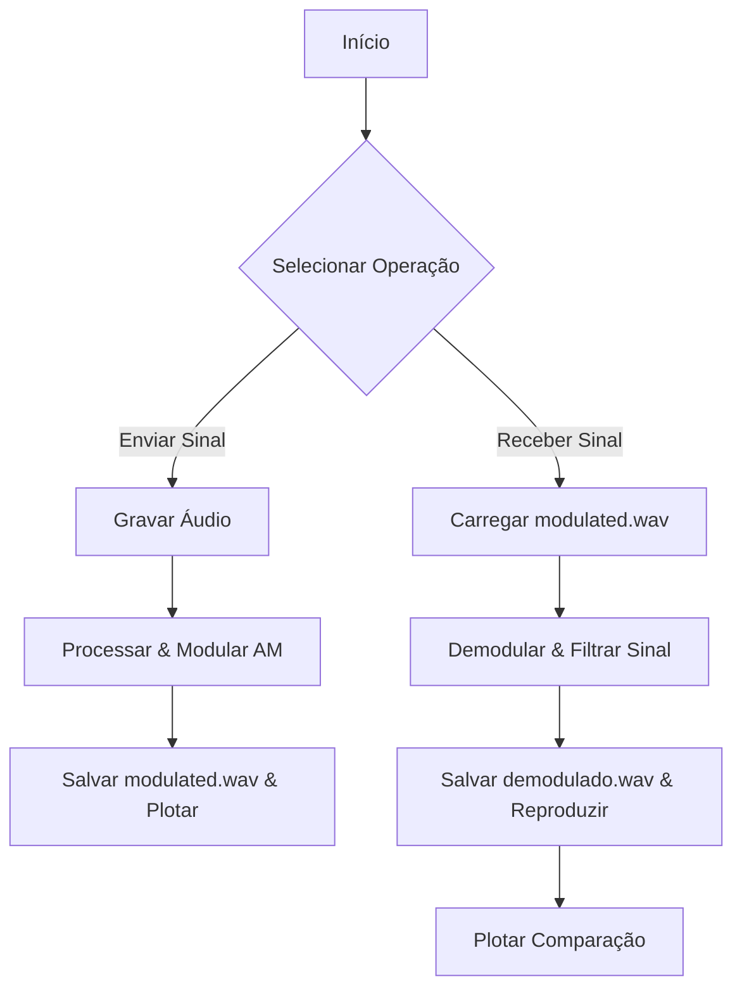

## Fluxo de Execução

```mermaid
graph TD
    A[Início] --> B{Selecionar Operação}
    B -->|Enviar Sinal| C[Gravar Áudio]
    C --> D[Processar & Modular AM]
    D --> E[Salvar modulated.wav & Plotar]
    B -->|Receber Sinal| F[Carregar modulated.wav]
    F --> G[Demodular & Filtrar Sinal]
    G --> H[Salvar demodulado.wav & Reproduzir]
    H --> I[Plotar Comparação]
```

