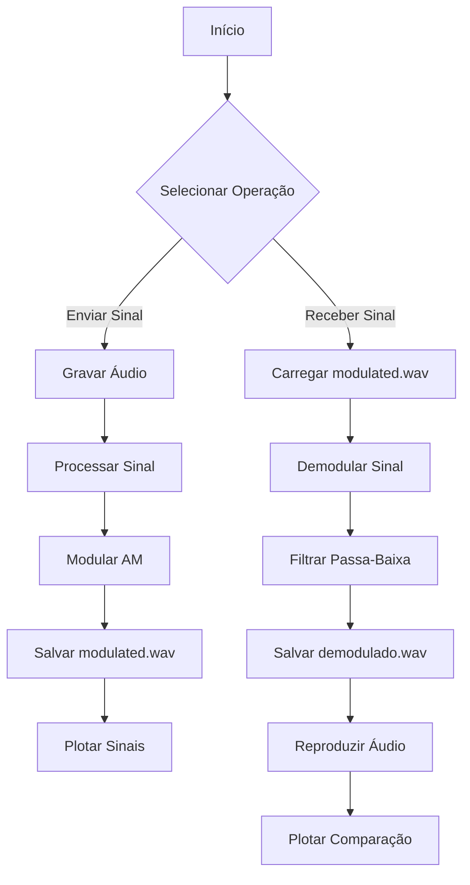

## Fluxo de Execução

```mermaid
graph TD
    A[Início] --> B{Selecionar Operação}
    B -->|Enviar Sinal| C[Gravar Áudio]
    C --> D[Processar Sinal]
    D --> E[Modular AM]
    E --> F[Salvar modulated.wav]
    F --> G[Plotar Sinais]
    
    B -->|Receber Sinal| H[Carregar modulated.wav]
    H --> I[Demodular Sinal]
    I --> J[Filtrar Passa-Baixa]
    J --> K[Salvar demodulado.wav]
    K --> L[Reproduzir Áudio]
    L --> M[Plotar Comparação]
```

